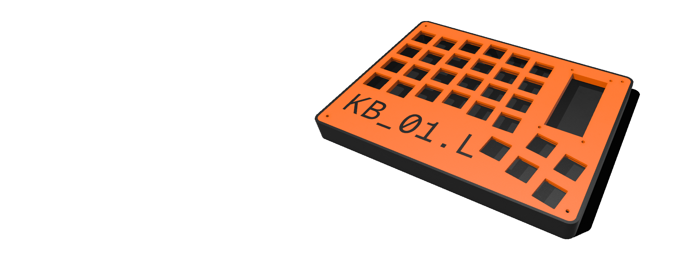

# KB_01

Проект DIY сплит клавиатуры
> _Эта клавиатура является очень спорным решением, я уже делаю новую вариант_

## Характеристики клавиатуры

- Количество клавиш : _58_
- МК: [stm32f103c8t6](https://www.st.com/resource/en/datasheet/stm32f103c8.pdf) 1 шт.
- Прошивка: [QMK](https://qmk.fm/)

## Сборка

### Материалы

- Проволока медная (_от 0.6мм_)
- Пластик для печати (_пример выполнени из PLA пластика_)

// ДОПИСАТЬ

## Прошивка

// ДОПИСАТЬ

---

**Автор:** Бровка Дионисий Сергеевич (_[GitHub](https://github.com/DionisiuBrovka)_) (_[Telegram](https://t.me/goppi)_) (_[Email](dionisiu.brovka@gmail.com)_)

---
