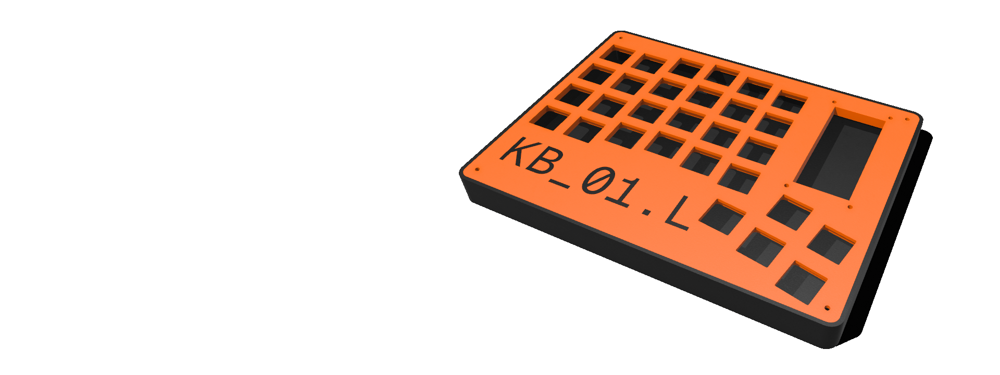

# KB_01



Проект DIY *сплит* клавиатуры c раскладкой удобной для русского языка.

## About

Тут надо написать про то как я до этого дошел.

## Hardware

* Hardware Supported: *The PCBs, controllers supported*
* Hardware Availability: *Links to where you can find this hardware*

## Firmware

Make example for this keyboard (after setting up your build environment):

```sh
make kb_01:default
```

Flashing example for this keyboard:

```sh
make kb_01:default:flash
```

See the [build environment setup](https://docs.qmk.fm/#/getting_started_build_tools) and the [make instructions](https://docs.qmk.fm/#/getting_started_make_guide) for more information. Brand new to QMK? Start with our [Complete Newbs Guide](https://docs.qmk.fm/#/newbs).

---

🌟 Keyboard Maintainer: [Dionisiu Brovka](https://github.com/DionisiuBrovka) **([Telegram](https://t.me/goppi)) ([Email](dionisiu.brovka@gmail.com))**
